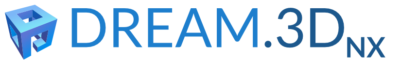
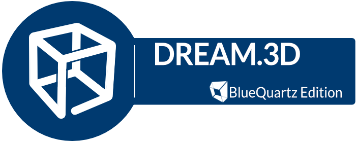

---
hide:
  - navigation
  - toc
---

## IMPORTANT NOTE



DREAM.3D Version 6 is considered legacy and all development has stopped. Please consider using DREAM3D-NX which can be downloaded from [https://www.dream3d.io](https://www.dream3d.io). DREAM3D-NX offers a much better user experience with its [integrated visualization](https://www.dream3d.io/FeatureGallery/) among its new features.

| Feature |  DREAM.3D v6  | DREAM3D-NX v7 |
|------------|---------|------------|
| Integrated Visualization | NO  |   YES |
| Actively Developed | NO  |   YES |
| Actively Supported | NO  |   YES |
| Easy Python Bindings | NO  |   YES |
| Crash Protection | NO  |   YES |
| New features being added | NO  |   YES |

<div class="grid cards" markdown>

- :octicons-arrow-right-24:{ .lg .middle } [Go Checkout DREAM3D-NX](https://www.dream3d.io)

</div>

## DREAM.3D Version 6.5.171



DREAM.3D consists of data analysis tools (Filters) that allow for the construction of customized workflows (Pipelines) to analyze data. DREAM.3D provides a flexible and extensible data structure that eases data transport between collaborators by storing data in a non-proprietary format.

DREAM.3D makes the reconstruction of 3D data simple and straight forward. The development of additional features is ongoing and the DREAM.3D development team welcomes your feedback whether you are a first time user or seasoned user.

All source codes are publicly available through the [GitHub](http://www.github.com/bluequartzsoftware/DREAM3D) repository and also has the official bug tracker.

DREAM.3D is completely open source and free for anyone to use whether that is in a commercial, academic or research setting. We encourage every one to give it a try and provide feedback about your experience.

## Features of DREAM.3D

+ 3D Reconstruction of EBSD data from EDAX (.ang), Oxford (.ctf) and Bruker (.ctf) data files. The reconstructions can utilize an array of alignment, cleaning, segmentation algorithms and coloring algorithms.
+ Synthetic microstructures can be created using a set of automatically generated statistics or your own statistics.
+ The reconstructed volumes can be exported as industry standard STL files, ParaView files (.xdmf), Abaqus (.inp). DREAM.3D stores all data as HDF5 files by default.
+ Many algorithms are available to extract various statistics about your data
+ Over 100 filters from the image processing library ITK

## Prebuilt Binaries

This version is legacy and will not be updated or supported past JAN 1 2024. If you need support for this
version of DREAM.3D please consider a paid support contract with [BlueQuartz Software](https://www.bluequartz.net)

The current version is 6.5.171 and is available in prebuilt binaries for MacOS, Windows and Linux operating systems:

| Operating System | Notes |
|------------------|----------------------|
| Signed [MacOS - DREAM3D-6.5.171-OSX-x86_64.dmg](https://dream3d.bluequartz.net/binaries/DREAM3D-6.5.171-OSX-x86_64.dmg) | MacOS 10.15 and greater required, including macOS 11.0. Download is a Disk Image |
| Unsigned [MacOS - DREAM3D-6.5.171-OSX-x86_64.zip](https://dream3d.bluequartz.net/binaries/DREAM3D-6.5.171-OSX-x86_64.zip) | MacOS 10.15 and greater required, including macOS 11.0. Download is a Zip file |
| Signed [MacOS - DREAM3D-6.5.171-OSX-arm64.dmg](https://dream3d.bluequartz.net/binaries/DREAM3D-6.5.171-OSX-arm64.dmg) | Apple M1 Arm build. Download is a DMG File |
| Unsigned [MacOS - DREAM3D-6.5.171-OSX-arm64.zip](https://dream3d.bluequartz.net/binaries/DREAM3D-6.5.171-OSX-arm64.zip) | Apple M1 Arm build. Download is a ZIP File |
| [Windows - DREAM3D-6.5.171-Win64.zip](https://dream3d.bluequartz.net/binaries/DREAM3D-6.5.171-Win64.zip) | Windows version 8,10,11 |
| [Linux - DREAM3D-6.5.171-Linux-x86_64.tar.gz](https://dream3d.bluequartz.net/binaries/DREAM3D-6.5.171-Linux-x86_64.tar.gz) | Ubuntu 18.04 or Equivelant. Self contained tar archive.  |

## Nightly Builds

The nightly builds are no longer available. Please use the officially released version above. 

## Python Anaconda Distribution

THIS IS NOW DEPRECATED AND NO LONGER UPDATED. [Please update to the latest DREAM3D-NX release](https://www.dream3d.io/python_docs)

```lang-console
(base) C:\Users\johnsmith> conda config --add channels conda-forge
(base) C:\Users\johnsmith> conda config --set channel_priority strict
(base) C:\Users\johnsmith> conda create -n pyD3D python=3.8
(base) C:\Users\johnsmith> conda activate pyD3D
(pyD3D) C:\Users\johnsmith> 
(pyD3D) C:\Users\johnsmith>conda install -c https://dream3d.bluequartz.net/binaries/conda dream3d-conda
(pyD3D) C:\Users\johnsmith>conda install libharu 2.0.0
```

## Documentation

+ The HTML documentation is located [here](https://dream3d.bluequartz.net/Help) and also available within the application itself.
+ BlueQuartz maintains a [YouTube Channel that has some instructional videos](https://www.youtube.com/channel/UCjeF8pFMzET5ZN3vsBHATpg)

## Discussion Group

If you are looking for help using DREAM.3D there is an [free discussion group on Google](https://groups.google.com/g/dream3d-users)

## Citing DREAM.3D in Publications

Users wishing to cite DREAM.3D in their research publications are referred to [https://link.springer.com/article/10.1186/2193-9772-3-5](https://link.springer.com/article/10.1186/2193-9772-3-5) for the proper citations.


+ Looking for the DREAM.3D Icon for a presentation? [This one is 2048 x 2048 pixels](images/DREAM3D_Logo.png)

